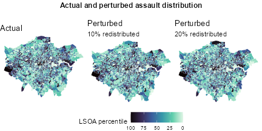
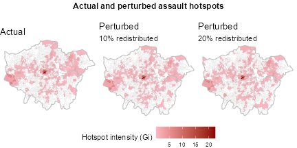

```{r, include = FALSE}
knitr::opts_chunk$set(
  collapse = TRUE,
  comment = "#>"
)
```

# Introduction

This package provides functions that geocode a short text description of a location. This is to allow the text descriptions collected as part of the assault location description field of the Emergency Care Data Set (ECDS) to be converted into locations identifiers free of any potential personal identifiable data, described by Lower Super Output Areas (LSOA). It does so without exposing the data involved to any external geocoding service and is designed to handle issues that are common in the way administrative and clinical staff capture this data.

Assault location description is a 255 character field in ECDS that is captured when a patient attends as the result of an assault. It may be collected at reception, triage or elsewhere in the patient journey by administrative or clinical staff. It is intended to indicate the location of an assault so that hotspots can be identified and preventative measures put in place (e.g. additional CCTV, police patrols etc.). It should be in a form similar to this:

> "Black Lion pub on Commercial Road"

If the patient was assaulted at their home address the text should be similar to:

> "Patient's home"

Because the field is free text it frequently contains other information which is not useful or contains PID.

# Method

The process of geocoding involves:

- cleaning the text
- extracting and validating any postcode like entities
- using a text classifier to identify if the assault is linked to the patient's home
- attempt to match to a place name contained within a data frame in a series of larger radius lower resolution slices

Once these steps have been completed the "best" candidate is selected as the location.

## Text cleaning

- convert text to lower case
- replace common abbreviations (e.g. pt with patient)
- remove any non-alphanumeric characters
- squish (i.e. remove multiple whitespace and whitespace at either end of string)
- de-duplicate - some strings emerge from clinical systems duplicated, e.g. "home home"

The list of common abbreviations is supplied by `abbreviations` data set in this package. This can be replaced/and or updated as necessary. Abbreviations does include abbreviations for hospital locations, e.g. WXH for Whipps Cross Hospital, where these are known.

## Extract postcodes

Postcode identification is handled by a regex looking for postcode like strings, then validation against a specific list of current valid postcodes. Before looking for the whole postcode, a loose regex is used to detect likely outcodes (the part of the postcode before the space, e.g. LU3) then attempts are made to verify this is a genuine postcode, and then match against increasingly lengthy partial postcodes (e.g. LU3 2, LU3 2JR) - often sites fully or partially redact a postcode and exact practice may differ.

## Text classification

The text classification function returns a home_flag column indicating either "home" (the assault likely took place at the patients home) or "other" (the assault likely took place somewhere else).

There are two text classifiers included with the package.

`assign_home()`: uses a random forest classifier based on [doc2vec](https://cran.r-project.org/web/packages/doc2vec/index.html) embeddings and a train/test data set of 5098/2069 assault location descriptions extracted from the ISTV dataset. The doc2vec embeddings were trained on the [first billion](http://mattmahoney.net/dc/enwik9.zip) characters of the English language wikipedia and the random forest classifier on manually classified training data (classified as "home" or "other"). Often these assault location descriptions include information that may imply that the location is the patients home location rather than explicitly using the word home. Examples include "outside front door" or identify another part of a house. The relationship to perpetrators is sometimes noted and this is also used - if the assault is by a family member, intimate partner or neighbour then the assault location is assumed to be home (note that all guidance about ISTV says that this kind of detail should not be captured). The word embedding file is supplied with the ISTV package, as is the random forest classifier. Performance of the model assessed on the test data set is:

| Prediction | Home (actual)  | Other (actual)  |
| ---------- | ---- | ----- |
| Home       | 237  | 37    |
| Other      | 45   | 1750  |

This has a sensitivity of 84.0%, specificity of 97.9% and accuracy of 96.0%.

`assign_home_simple()`: the word embedding file mentioned above is 427MB. If this file cannot be distributed with the package this gives a simpler embedded model of assigning home locations. It uses a few common phrases like "patients house" to identify a match to a home location - these are embedded in the function. Performance of this assessed on the test data set above is:

| Prediction | Home (actual) | Other  (actual) |
| ---------- | ---- | ----- |
| Home       | 166  | 1     |
| Other      | 116  | 1786  |

This has a sensitivity of 58.9%, specificity of 99.9% and accuracy of 94.0%.

Any other text classifier that takes the same inputs and returns the same outputs can be substituted. 

## Place name matching

Place name matching is done on words, bigrams and trigrams extracted from both the text strings supplied in assault location description and a file of place names. Matching is done on the word as supplied, and a phonetic encoding of the word to reduce problems resulting from minor typos and spelling errors.

### Construction of place name data frame

The place name data frame supplied with this package covers London in detail, and the rest of the UK and world at a lower resolution and is constructed from the following data sources.

- postcode address file - detailed and contains venue and business names for a 10km radius buffer around London. Obtained from Ordnance Survey via the public sector geospatial agreement. 

- OS Open Name - higher level but even if PAF is in use, good to add in towns outside of the area covered by your PAF extract, covers the whole of the UK. Currently at [https://www.ordnancesurvey.co.uk/products/os-open-names](https://www.ordnancesurvey.co.uk/products/os-open-names) 

- OS Greenspace - contains names of open spaces. Currently at [https://www.ordnancesurvey.co.uk/products/os-open-greenspace](https://www.ordnancesurvey.co.uk/products/os-open-greenspace)

- Local Authority District names - in some cases these aren't the same as names of populated places but often used as reference. Obtained from [https://geoportal.statistics.gov.uk/](https://geoportal.statistics.gov.uk/).

- FCDO country names - to cover places outside the UK. Currently at [https://www.gov.uk/government/publications/geographical-names-and-information](https://www.gov.uk/government/publications/geographical-names-and-information)

- Postcode polygons - to assign postcode districts to points where that has not already been done in the source. Obtained from OS via PSGA, it comes as as series of shapefiles for each postcode area.

- LSOA polygons - to assign all points to an LSOA for later processing. Obtained from [https://geoportal.statistics.gov.uk/](https://geoportal.statistics.gov.uk/).

- All London ED sites from a locally maintained list (there are currently 28).

When constructing the place name data frame a few minor alterations are made to fit with commmon ways that place names are written.

- public transport is given options of being referred to by "railway station", "station", "tube" etc as appropriate.
- prisons have the HMP as optional
- schools can be referred to as school/college/primary/secondary etc
- the text is cleaned using the `clean_text()` function
- duplicates with the same name in the same LSOA are removed - this sometimes happens for shop units within a station for example
- a small number of entries that consistently give misleading results are removed - e.g. anything with the initialism LAS (London Ambulance Service)
- duplicates arising from the same name in multiple datasets are removed, e.g. the same name from LADs and populated places

This data frame is quite large (over 700,000 rows). 

### Matching

Both the place name data frame and assault location description are broken up into n-grams (1 ≤ n ≤ 3). There is some logic to deal with the abbreviation St. which might mean either Saint or Street depending on context. These n-grams are given phonetically encoded (see `unigram_tibble()` for details of encoding). The n-grams are then linked on the phonetic encoding both for the singular and plural versions of the words in the n-gram. 

> Assault location description is "street outside black hawrse pub"
> Place names candidates are
>
> | id | place name |
> |--|---|
> |1 |High street|
> |2 |St George's Church|
> |3 |Black Horse|
>
> This results in a data frame for the place names of 
>
> |id|token|phonetic encoding|
> |--|---|---|
> |1|high|H040|
> |1|street|S36906|
> |1|high street|H040 S36906|
> |2|saint|S3086|
> |2|georges|G409403|
> |2|church|C30930|
> |2|saint georges|S3086 G409403|
> |2|georges church|G409403 C30930|
> |2|saint georges church|S3086 G409403 C30930|
> |3|black|B1703|
> |3|horse|H0930|
> |3|black horse|B1703 H0930|
>
> and a similar data frame for the assault location description. These two dataframes are then joined on the phonetic encoding column using an inner join. This results in a data frame
>
> |id|place name token|assault location token|phonetic encoding|
> |--|---|---|---|
> |1|street|street|S36906|
> |3|black|back|B1703|
> |3|horse|hawrse|H0930|
> |3|black horse|black hawrse|B1703 H0930|
> 
> containing the IDs of potential place name matches

The quality of the match is assessed on a number of metrics:

- the number of stopwords in the joint phrase (fewer stopwords is better)
- the number of non-dictionary words in the joint phrase (more non-dictionary words are better - more likely to be unusual placenames not in a standard dictionary)
- whether the match is on the original n-gram or the phonetic encoding (original is better)
- the length of the n-gram matched (longer is better)
- whether the match is on the original n-gram or a plural version (original is better)
- the length of the match both as a percentage of the assault location description and as a percentage of the placename
- the frequency of the word in a large corpus of English text (lower frequency is better)

The place name data frame supplied with the package has a pre-calculated version of this, and similarly other precalculated tokens can be supplied to the matching functions - this substantially improves computational times.

## Preferred candidate

The preferred candidate location is selected depending on both the metrics above and the proximity of the site attended to the potential match. A series of expanding rings is searched for potential matches 

- if an outcode is detected within the assault location description the place name data frame is filtered to that outcode.

- if there is no outcode or no potential matches returned from this filter then assault location description is searched for town or placenames within 10km of the site attended. A complete list of possible locations is filtered within 2km of this town location.

- then a radius of 10km from the site attended is filtered. If there are results from this step and the previous one, they are concatenated. 

- If there is no output from the previous step then localities and populated places within 50km are searched on the grounds that most people will identify a place further away with a lower resolution

- if no potential matches have yet been found the whole of the UK is searched for a town or LAD matches, and the list of countries is searched.

Then the quality of the matches resulting from this process is assessed.

- matches where the entire candidate is much longer than the entire target are excluded - this is excludes cases such "epsom town" as a target from matching "epsom community recycling centre and transfer station" which would match on the token "epsom". 
- matches consisting of a single dictionary word are excluded. Note that the dictionary has been modified to exclude common London placenames that could be words - examples include "Barking".
- exclude matches where the length of the n-gram is less than a threshold (50%) of the target
- keep only those with a maximum percentage match
- discard examples where stopwords are *more* than 50% of a match
- prefer matches with a lower overall frequency in the english languge
- prefer longer matches
- prefer matches on streets over matches to towns
- prefer matches closer to the site attended
- if all matches have the same name, take the nearest
- if all matches are within a small area (roughly 5000m2, shouting distance) just take the top one as it is easily a good location

If there is only one match remaining this is an "unambiguous match", otherwise it is ambiguous.

The exact detail of this can be found in `select_candidate()`. 

Finally all of the potential options for a match are assessed, and the location is assigned in this order of preference.

- if the address has a postcode and is identified as a home location the postcode is used
- home
- postcode
- postcode sector (i.e. the postcode minus the last two digits)
- any unambiguous match
- postcode district
- the closest ambiguous match

# Performance

Performance of this matching method has been assessed on a subset of 3000 assault location descriptions extracted from sites that tend to report a high proportion of geolocatable entries (St George's, Royal London, Whittington). Different hospitals have different styles for entering data so it was necessary to look across several.

Each entry was compared to the judgement of a hypothetical "sensible human" interpreting the assault location description. Entries were either coded as:

- correct
- correct but could be matched at a higher resolution
- wrong (because of typo or misspelling in original entry, or indicates a transfer from another hospital)
- wrong (for other reasons)

A number of entries were ambiguous, e.g. chicken shop in Shadwell could be several different locations and the correct interpretation for these is assumed to be no match. 


> |is|should be place|should be no match|should be home|should be other place|
> |---|---|---|---|---|
> |place|1198|40|1|210|
> |no match|76|1203|14|2|
> |home|24|15|216|0|

Looking at the reasons for errors:

> |entry is|n|%|% (treating low resolution matches as correct)|% (treating low res as correct and excluding misspellings)|
> |---|---|---|---|---|
> |correct|2615|87%|90%|92%|
> |low resolution|77|3%|
> |misspelling or transfer|85|3%|3%|
> |not in pndf|14|0%|0%|0%|
> |bug|11|0%|0%|0%|
> |unknown|197|7%|7%|7%|

87% of all entries are coded correctly. This rises to 92% when counting low resolution matches as matches and excluding matches thrown by misspellings or transfers (i.e. incorrect assault location descriptions).

The effect of this inaccuracy on ISTV like data is demonstrated below. Using police recorded crime data (Met Police, violence against the person Aug 24-Sep 25, [data.police.uk](data.police.uk)), frequency of violence crime was calculated by LSOA. This was used to generate a count of reported "ISTV" assaults per LSOA by multiplying by roughly the number of reported ISTV assaults per year (20,000). The distribution was then perturbed by redistributing 10% of assaults and 20% of assaults. Hotspots were calculated using Getis Ord Gi statistic.

 

 

Figure 1 shows the effect on the raw distribution of assaults and Figure 2 shows the effect on hotspots. While there are local differences the large scale patterns, both for the raw distribution and hotspots are very similar. For LSOAs in the top decile, 90% of values changed by less than 3% and 8% for 10% perturbation and 20% perturbation respectively, in other words the LSOAs with the most assaults still have high numbers.

# Use

```{r setup}

txt <- tibble::tibble(site_code = c("R1H12", "RJ701", "RKEQ4"), 
              attendance_dt = lubridate::as_datetime("2025-01-01 08:00:00"),
              injury_dt = lubridate::as_datetime("2025-01-01 07:00:00"),
              injury_intent = "Assault",
              injury_mechanism = c("Blunt force","Sharp object","Asphyxiation"),
              assault_location_description = c("Tower hamlets mission", "Nandos in wimbledon", "Holloway Road"))

g <- istv::geocode_text(txt)

print(g)

```


